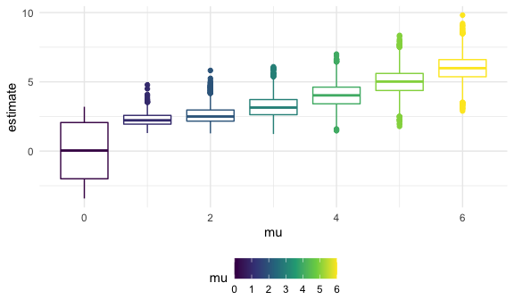

Homework 5
================
Jerry Chao, Uni: Jyc2171
November 16, 2020

``` r
library(tidyverse)
```

    ## ── Attaching packages ──────────────────────────────────────────────────────────────────────────────────── tidyverse 1.3.0 ──

    ## ✓ ggplot2 3.3.2     ✓ purrr   0.3.4
    ## ✓ tibble  3.0.3     ✓ dplyr   1.0.2
    ## ✓ tidyr   1.1.2     ✓ stringr 1.4.0
    ## ✓ readr   1.3.1     ✓ forcats 0.5.0

    ## ── Conflicts ─────────────────────────────────────────────────────────────────────────────────────── tidyverse_conflicts() ──
    ## x dplyr::filter() masks stats::filter()
    ## x dplyr::lag()    masks stats::lag()

``` r
library(rvest)
```

    ## Loading required package: xml2

    ## 
    ## Attaching package: 'rvest'

    ## The following object is masked from 'package:purrr':
    ## 
    ##     pluck

    ## The following object is masked from 'package:readr':
    ## 
    ##     guess_encoding

``` r
knitr::opts_chunk$set(
  fig.width = 6,
  fig.asp = .6,
  out.width = "90%"
)

theme_set(theme_minimal() + theme(legend.position = "bottom"))

options(
  ggplot2.continuous.colour = "viridis",
  ggplot2.continuous.fill = "viridis"
)

scale_colour_discrete = scale_color_viridis_d
scale_fill_discrete = scale_fill_viridis_d
```

## Problem 1

Read in the data.

``` r
homicide_df =
  read_csv("homicide_data/homicide-data.csv") %>%
  mutate(
    city_state = str_c(city, state, sep = "_"),
    resolved = case_when(
      disposition == "Closed without arrest" ~ "unsolved",
      disposition == "Open/No arrest"        ~ "unsolved",
      disposition == "Closed by arrest"      ~ "solved"
    )
  ) %>%
  select(city_state, resolved) %>% 
  filter(city_state != "Tulsa_AL")
```

    ## Parsed with column specification:
    ## cols(
    ##   uid = col_character(),
    ##   reported_date = col_double(),
    ##   victim_last = col_character(),
    ##   victim_first = col_character(),
    ##   victim_race = col_character(),
    ##   victim_age = col_character(),
    ##   victim_sex = col_character(),
    ##   city = col_character(),
    ##   state = col_character(),
    ##   lat = col_double(),
    ##   lon = col_double(),
    ##   disposition = col_character()
    ## )

Let’s look at this a bit

``` r
aggregate_df =
  homicide_df %>% 
  group_by(city_state) %>% 
  summarize(
    hom_total = n(),
    hom_unsolved = sum(resolved == "unsolved")
  )
```

    ## `summarise()` ungrouping output (override with `.groups` argument)

``` r
homicide_df %>% 
  group_by(city_state) %>% 
  summarize(
    hom_total = n()
  ) %>% 
  arrange(hom_total)
```

    ## `summarise()` ungrouping output (override with `.groups` argument)

    ## # A tibble: 50 x 2
    ##    city_state        hom_total
    ##    <chr>                 <int>
    ##  1 Tampa_FL                208
    ##  2 Savannah_GA             246
    ##  3 San Bernardino_CA       275
    ##  4 Durham_NC               276
    ##  5 Denver_CO               312
    ##  6 Minneapolis_MN          366
    ##  7 Sacramento_CA           376
    ##  8 Albuquerque_NM          378
    ##  9 Long Beach_CA           378
    ## 10 Omaha_NE                409
    ## # … with 40 more rows

Can I do a prop test for a single city?

``` r
prop.test(
  aggregate_df %>%  filter(city_state == "Baltimore_MD") %>%  pull(hom_unsolved),
  aggregate_df %>%  filter(city_state == "Baltimore_MD") %>%  pull(hom_total))
```

    ## 
    ##  1-sample proportions test with continuity correction
    ## 
    ## data:  aggregate_df %>% filter(city_state == "Baltimore_MD") %>% pull(hom_unsolved) out of aggregate_df %>% filter(city_state == "Baltimore_MD") %>% pull(hom_total), null probability 0.5
    ## X-squared = 239.01, df = 1, p-value < 2.2e-16
    ## alternative hypothesis: true p is not equal to 0.5
    ## 95 percent confidence interval:
    ##  0.6275625 0.6631599
    ## sample estimates:
    ##         p 
    ## 0.6455607

So can repeat this for each city\_state - this is an iteration issue The
input is city\_state

``` r
prop.test(
  aggregate_df %>%  filter(city_state == "Baltimore_MD") %>%  pull(hom_unsolved),
  aggregate_df %>%  filter(city_state == "Baltimore_MD") %>%  pull(hom_total)) %>% 
  broom::tidy()
```

    ## # A tibble: 1 x 8
    ##   estimate statistic  p.value parameter conf.low conf.high method    alternative
    ##      <dbl>     <dbl>    <dbl>     <int>    <dbl>     <dbl> <chr>     <chr>      
    ## 1    0.646      239. 6.46e-54         1    0.628     0.663 1-sample… two.sided

Try to iterate ……… Try to create a fourth column that has the data that
is requested in homework assignment

``` r
#conceptually, this is the framework:
#aggregate_df %>% 
#  mutate(
#    prop_tests = map( ....... )
#  )

results_df =
aggregate_df %>% 
  mutate(
    prop_tests = map2(.x = hom_unsolved, .y = hom_total, ~prop.test(x = .x, n = .y)),
    tidy_tests = map(.x = prop_tests, ~broom::tidy(.x))
  ) %>% 
  select(-prop_tests) %>% 
  unnest(tidy_tests) %>% 
  select(city_state, estimate, conf.low, conf.high)
```

``` r
results_df %>%
  mutate(
    city_state = fct_reorder(city_state, estimate)  
  ) %>%
  ggplot(aes(x = city_state, y = estimate)) +
  geom_point() +
  geom_errorbar(aes(ymin = conf.low, ymax = conf.high)) +
  theme(legend.position = "bottom", axis.text.x = element_text(angle = 90, vjust = 0.5, hjust = 1))
```


``` r
# this is an alternate way to approach
# city_prop_tst = function(df) {
  
#  n_unsolved ...
#  n_total ...

#  prop.test(........)  
  
#}

homicide_df =
  read_csv("homicide_data/homicide-data.csv") %>%
  mutate(
    city_state = str_c(city, state, sep = "_"),
    resolved = case_when(
      disposition == "Closed without arrest" ~ "unsolved",
      disposition == "Open/No arrest"        ~ "unsolved",
      disposition == "Closed by arrest"      ~ "solved"
    )
  ) %>%
  select(city_state, resolved) %>% 
  filter(city_state != "Tulsa_AL") %>% 
  nest(data = resolved)
```

    ## Parsed with column specification:
    ## cols(
    ##   uid = col_character(),
    ##   reported_date = col_double(),
    ##   victim_last = col_character(),
    ##   victim_first = col_character(),
    ##   victim_race = col_character(),
    ##   victim_age = col_character(),
    ##   victim_sex = col_character(),
    ##   city = col_character(),
    ##   state = col_character(),
    ##   lat = col_double(),
    ##   lon = col_double(),
    ##   disposition = col_character()
    ## )

## Problem 2

``` r
study_data = 
  tibble(
    files = list.files("lda_data"),
    path = str_c("lda_data/", files)
  ) %>% 
  mutate(data = map(path, read_csv, col_types = "dddddddd")) %>% 
  unnest() %>% 
  pivot_longer(
    week_1:week_8,
    names_to = "week",
    values_to = "repeated_measure"
  ) %>% 
  select(-path) %>% 
  rename(
    arm_id = files
  ) %>%
  separate(arm_id, into = c("arm_id", ".csv"), sep = 6) %>% 
  select(-.csv)
```

    ## Warning: `cols` is now required when using unnest().
    ## Please use `cols = c(data)`

``` r
#Spaghetti plot
study_data %>% 
  ggplot(aes(x = week, y = repeated_measure)) +
  geom_point(aes(color = arm_id)) +
  geom_line(aes(group = arm_id, color = arm_id))
```


The spaghetti plot shows that in general, subjects in the experimental
arm (denoted by warm colors) generally have higher values of the
repeated measure compared to subjects in the control arm. In addition,
the values of the repeated measure trends upwards over time in the
experimental arm (that is, the value of the repeated measure increases
weekly), more so than in the control arm.

# Problem 3

``` r
#First, I will create the function using the specified given data:

t_test = function(samp_size = 30, mu = 0, sigma = 5) {
  
  sim_data =
    tibble(
      x = rnorm(n = samp_size, mean = mu, sd = sigma)
    )

  test = t.test(x ~ 1, data = sim_data)
  
  broom::tidy(test)
  
}

####
##for loop approach?
# plot_data = c()
# for (i in 0:6) {
#   plot_data[[i+1]] =
#     tibble(mu = i) %>%
#     mutate(raw = map(.x = mu, ~ rerun(5000, rnorm(30, .x, 5)))) %>%
#     unnest(raw) %>%
#     mutate(
#       t_test = map(.x = raw, ~ t.test(.x, mu =0, sd = 5)),
#       t_test = map(t_test, broom::tidy)
#     ) %>%
#     unnest(t_test) %>%
#     mutate(t_accept_h0 = p.value > 0.05)
# }
# plot_data = plot_data %>% bind_rows()
####
```

``` r
#first doing 100 simulations, will expand to 5000 later after I get the code correct

sim_results = 
  tibble(mu = 0:6) %>% 
  mutate(
    output_lists = map(.x = mu, ~rerun(100, t_test(mu = .x))),
    estimate_dfs = map(output_lists, bind_rows)
  ) %>% 
  select(-output_lists) %>% 
  unnest(estimate_dfs) %>% 
  select(mu, estimate, p.value)


# n_list =
#   list(
#     "mu = 0" = 1,
#     "mu = 1" = 2,
#     "mu = 2" = 3,
#     "mu = 3" = 4,
#     "mu = 4" = 5,
#     "mu = 5" = 6,
#     "mu = 6" = 7
#   )

# output = vector("list", length = 7)
# 
# for (i in 1:7) {
#   
#   output[[i]] = rerun(10, t_test(mu = n_list[[i]])) %>% 
#     bind_rows()
#   
# }

# sim_results = 
#   tibble(
#     mu = c(1, 2, 3, 4, 5, 6, 7)
#   ) %>% 
#   mutate(
#     output_lists = map(.x = mu, ~ rerun(30, t_test(.x)))  ),
#     estimates_p_val = map(output_lists, bind_rows)
#   )  
#       
#       estimate_df = map(output_lists, bind_rows)
#     ) %>% 
#     select(-output_lists) %>% 
```

``` r
#Full 5000 simulations per mu level

sim_results = 
  tibble(mu = 0:6) %>% 
  mutate(
    output_lists = map(.x = mu, ~rerun(5000, t_test(mu = .x))),
    estimate_dfs = map(output_lists, bind_rows)
  ) %>% 
  select(-output_lists) %>% 
  unnest(estimate_dfs) %>% 
  select(mu, estimate, p.value)

#Plot of proportion of times the null was rejected.  I am interpreting this to mean the proportion of p values < 0.05

significance_df =
sim_results %>% 
  mutate(
    stat_sig = case_when(
      p.value > 0.05 ~ "not significant",
      p.value < 0.05 ~ "significant"
    )
  )

prop_sig =
significance_df %>% 
  group_by(mu) %>%
  summarize(
    mu_total = n(),
    mu_sig = sum(stat_sig == "significant")
  )
```

    ## `summarise()` ungrouping output (override with `.groups` argument)

``` r
#Plot of true value of mu on x axis and proportion of statistically significant p values on y axis:
prop_sig %>% 
  ggplot(aes(x = mu, y = mu_sig, color = mu)) +
  geom_point() +
  geom_line()
```


``` r
#Plot of estimates on y axis and true value of mu on x axis
sim_results %>% 
  ggplot(aes(x = mu, y = estimate, group = mu, color = mu)) +
  geom_boxplot()
```


``` r
#Plot of estimates on y axis for statistically significant p values and mu on x axis
significance_df %>%
  filter(
    stat_sig == "significant"
  ) %>% 
  ggplot(aes(x = mu,  y = estimate, group = mu, color = mu)) +
  geom_boxplot()
```



As mu (or the effect size) increases, the proportion of statistically
significant p values \< 0.05, and by convention, the proportion of times
the null hypothesis is rejected (the power of the test) increases,
approaching near 100% at a mu of 4.

When including all values of estimated mu’s (aka mu “hat”) without
accounting for statistical significance, estimates of mu from a sample
of 5000 are approximately equal to the true value of mu.

When including only values of estimated mu’s (mu “hats”) that are
statistically significant (p value \< 0.05), estimates of mu from a
sample of 5000 are higher than the true value of mu, but only for true
mu values of 1, 2, and 3. This difference seems to disappear at mu’s of
\>4, because at those effect sizes, the majority of p values are
statistically significant. For an effect size of zero (mu = 0), the
average estimated mu is less than the true mu
